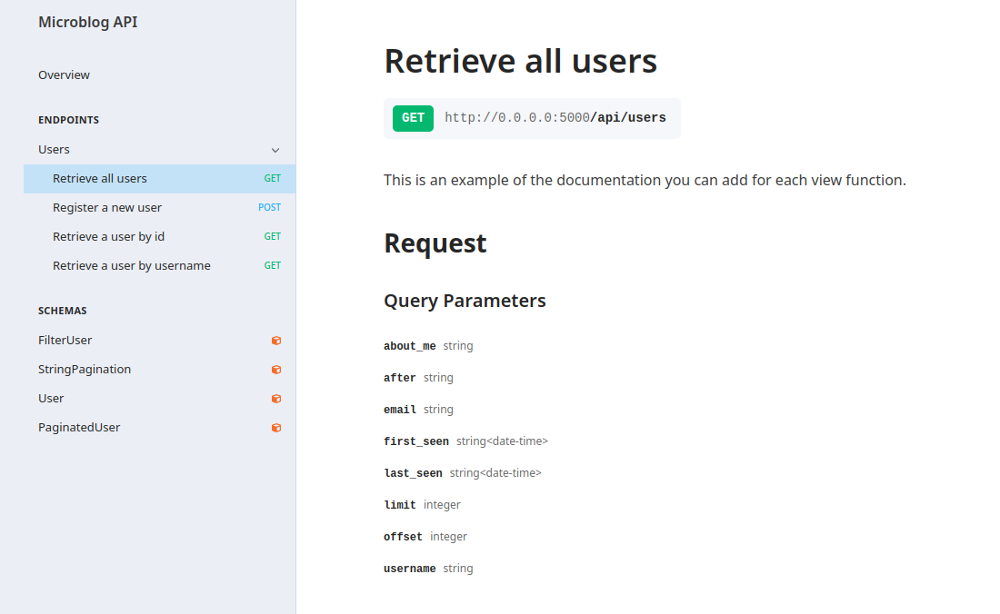

Commenting API Documentation
===============

Each endpoints summary will, by default, be named with the view functions name. This is generally not a user friendly formatted name and this functionality can be overridden by using a docstring on your view.

- If the docstring has only one line this will become the summary of each endpoint/method.
- If the docstring has more that one line, it will form both the summary and overall discription of that enpoint/method.




```
@posts_blueprint.route('/posts/<int:id>', methods=['PUT'])
@authenticate(token_auth)
@response(users_schema)
def all_users():
    """Retrieve all users.
       This is an example of the documentation you can add for each view function
    """
    return Users.select()
```
