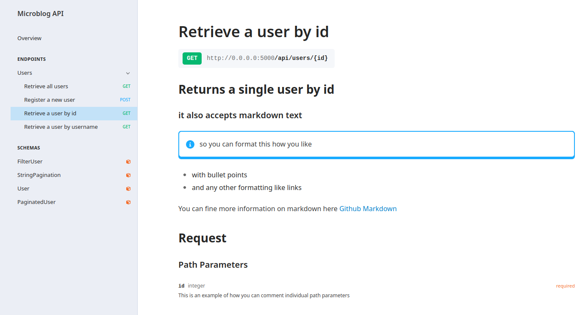

Commenting API Documentation
===============

Title & Version No
------------------

The following configural variables can be set to effect the descriptors TITLE & VERSION NO.

- APIFAIRY_TITLE = "Blog API"   (default - No title)
- APIFAIRY_VERSION = '1.0.0'    (default - NO version)

API Overview
-----------------

A full description of the API with its own dedicated page (overview) can be set by adding a docstring to the __init__.py of the flask apps main module. This can be formatted using markdown text and can be as full and complete as possible. 

Endpoint/methods descriptions
------------------------------

Each endpoint's summary (short text associated to each endpoint) will, by default, be named with the view functions name. This is generally not a user friendly formatted name and the functionality can be overridden by using a docstring on each of your views.

- If the docstring has only one line this will become the summary of each endpoint/method.
- If the docstring has more that one line, it will form both the summary and overall description of that endpoint/method.

.. image:: _static/comment_docs.png
  :width: 100%
  :alt: Automatic documentation example

.. code-block:: python

    @posts_blueprint.route('/posts/<int:id>', methods=['PUT'])
    @authenticate(token_auth)
    @response(users_schema)
    def all_users():
        """Retrieve all users.
           This is an example of the documentation you can add for each view function
        """
        return Users.select()
        
Custom Decorators
------------------

There may be a situation where you crease a custom decorator for you view to facilitate pagination or similar.

.. code-block:: python

    @users.route('/users', methods=['GET'])
    @paginated_response(users_schema)
    def all():       
        return User.select()
        
In this situation you can add a docstring to the schema that is passed to the decorator and this will append to the endpoints comments. 
        
    
Commenting individual path parameters
-------------------------------

If your view function accepts parameters, these will form the path parameters of that endpoint, there may be a case where you wish to comment individual params. In this case as above, add these to the docstring in the following format.

  | Retrieve a user by id
  | ## Returns a single user by id
  | ### it also accepts markdown text
  | > so you can format this how you like
  | - with bullet points
  | - and any other formatting like links
  |
  | You can find more information on markdown here [Github Markdown](https://docs.github.com/en/get-started/writing-on-github/getting-started-with- writing-and-formatting-on-github/basic-writing-and-formatting-syntax#links)
  |
  | id:: This is an example of how you can comment individual path parameters id--  

It will format you endpoint in the following manor, notice how the last line is moved to the `Path Parameters` id field.

